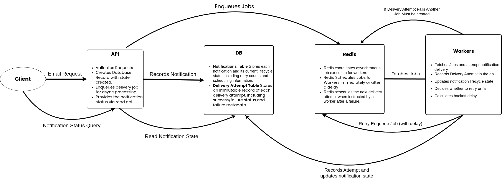

# Architecture

This document describes the high-level architecture of **Relays**,
focusing on component responsibilities, data flow, and failure handling.

The system is intentionally designed for a single-region, single-instance deployment.

---

## High-Level Architecture Diagram

## Core Components

### API Service (FastAPI)

Responsibilities:

- Accept HTTP notification requests
- Validate request payloads
- Persist notification intent to PostgreSQL
- Enqueue delivery jobs for asynchronous processing
- Expose notification status via read APIs

Non-responsibilities:

- Sending emails
- Retrying deliveries
- Managing backoff or failure logic

**_The API never attempts delivery directly._**

---

### DB (Primary Data Store)

PostgreSQL is the **source of truth** for the system.

It stores:

- Notifications and their lifecycle state
- Delivery attempts and failure metadata
- Retry counts and scheduling information

All state transitions are persisted to PostgreSQL.
If Redis or workers fail, PostgreSQL represents the authoritative system state.

---

### Redis (Queue and Scheduling)

Redis is used as a **temporary coordination mechanism**, not as a source of truth.

Responsibilities:

- Hold pending delivery jobs
- Schedule retries with delays (backoff)
- Enable asynchronous processing by workers

Redis does not store authoritative notification state.
Loss of Redis data does not result in permanent notification loss.

---

### Workers (Background Processor)

Workers are responsible for:

- Fetching jobs from Redis
- Attempting email delivery via the configured provider
- Recording delivery attempts in PostgreSQL
- Updating notification lifecycle state
- Scheduling retries when failures occur

Workers are the only components allowed to transition notifications
into terminal states (`sent`, `failed`).

---

## End-to-End Flow

1. Client submits email notification request to API
2. API validates input
3. API persists notification with state `created`
4. API enqueues delivery job in Redis
5. Worker picks up job and transitions state to `processing`
6. Worker attempts email delivery
7. Worker records delivery attempt
8. Notification state transitions to `sent`

---

## Failure Handling and Retries

### Delivery Failure

- A failed delivery attempt is recorded with error metadata
- Notification remains non-terminal
- Worker computes next retry time using backoff
- Job is re-enqueued with delay

### Retry Exhaustion

- Once max retry attempts are reached:
  - Notification transitions to `failed`
  - No further retries are scheduled

---

## Crash Scenarios

### API Crash After Persist, Before Enqueue

- Notification exists in PostgreSQL
- A recovery or periodic enqueue mechanism can requeue it

### Worker Crash During Delivery

- No terminal state is written
- Notification remains retryable
- Subsequent worker run retries safely

### Redis Data Loss

- No notification data is lost
- Pending notifications can be re-enqueued from PostgreSQL

---

## Design Principles

- PostgreSQL is the source of truth
- Redis is disposable
- Workers own delivery and retries
- All state transitions are persisted
- Failures are explicit and inspectable
